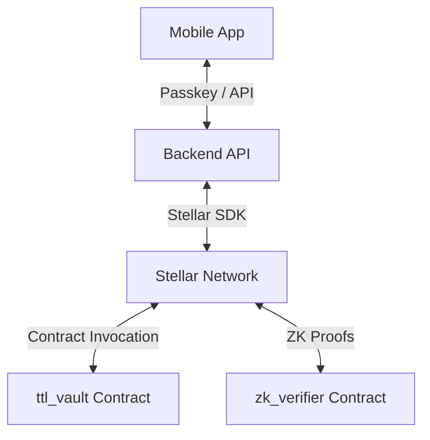
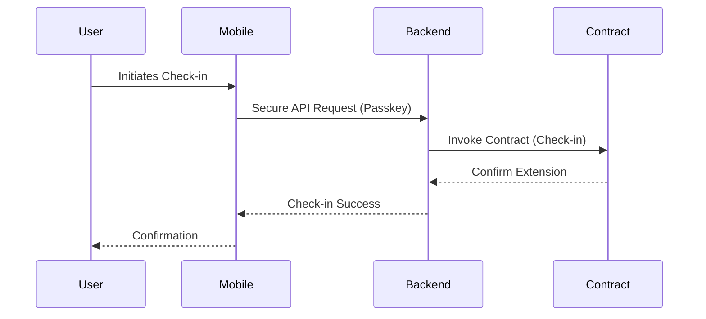
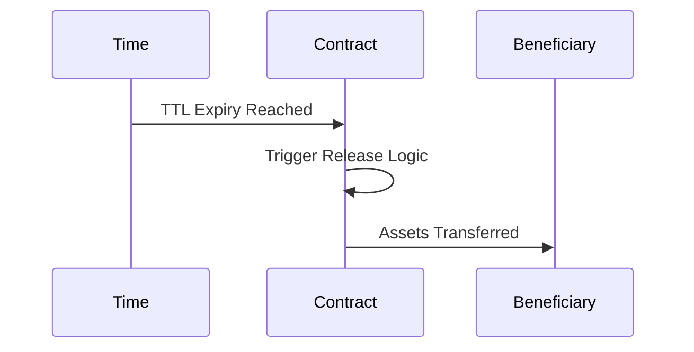

# Architecture Overview

The TTL-Legacy system is a decentralized, secure, and user-friendly platform built on the Stellar blockchain, designed to manage vault lifecycles based on Time-To-Live (TTL) logic.

## Component Diagram

The following diagram illustrates the interaction between the primary system components:

## Technology Stack

| Component | Technology | Rationale |
| :--- | :--- | :--- |
| **Smart Contracts** | Rust / Soroban | Secure, performant, and native to Stellar. |
| **Backend** | Rust / Axum | Type-safe, high-concurrency, efficient performance. |
| **Mobile (Android)** | Kotlin | Native performance, jetpack compose UI. |
| **Mobile (iOS)** | Swift | Native performance, SwiftUI. |
| **Blockchain** | Stellar | Low cost, fast finality, robust smart contract platform. |

## Data Flows

### Check-in Flow

This flow allows the vault owner to prove they are active and extend the TTL.

### Release Flow

When a vault reaches the end of its TTL without a successful check-in, the funds/assets are released to the designated beneficiary.

## Component Documentation

For detailed information on specific components, please refer to the following:

- **Smart Contracts**: `contracts/ttl_vault/src/lib.rs`, `contracts/zk_verifier/src/lib.rs`
- **Backend API**: `docs/backend-api.md`, `docs/openapi.yaml`
- **TTL Logic**: `docs/ttl-logic.md`
- **Mobile Passkeys**: `docs/mobile-passkey-flow.md`, `docs/passkeys.md`
- **ZK Verifier**: `docs/zk-verifier.md`
- **Token Management**: `docs/token-management.md`
